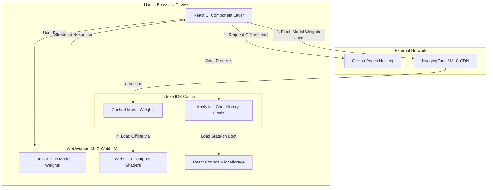

# 🏛️ Architecture & Technical Report

This document outlines the system architecture, model optimizations, data flow, privacy validations, and attributions for **StudBud AI**.

---

## 1. System Architecture & Data Flow

StudBud AI is designed as a **100% Client-Side Progressive Web App (PWA)**. There are no backend servers involved in the core logic or AI inference.

### Key Design Decisions:
- **PWA Service Workers:** Caches all React/HTML/CSS assets. Once loaded, the site works completely offline without a Wi-Fi connection.
- **WebWorker Offloading:** The AI inference runs inside a dedicated WebWorker so that the React UI thread never blocks or stutters during generation.
- **Mock RAG Implementation:** We embed a small mock textbook dataset (`textbooks.json`) locally and use lightweight keyword string-matching to simulate Retrieval-Augmented Generation (RAG) completely on-device.

---

## 2. Technical Report

We carefully selected and optimized the AI model to strike a balance between high-quality instructional responses and the strict hardware limitations of consumer web browsers.

- **Model Used:** Meta's `Llama-3.2-1B-Instruct`
- **Runtime:** `@mlc-ai/web-llm` running over WebGPU API.
- **Quantization:** `q4f32_1` (4-bit weight quantization, Float32 activations). We specifically chose `f32` instead of `f16` to ensure **maximum hardware compatibility**, allowing the AI to run on older integrated Intel/AMD graphics cards and non-Apple mobile devices that lack native Float16 shader support.
- **Model Size (VRAM):** ~850 MB (Peak memory usage during generation is strictly kept under 1.5 GB).
- **Context Window:** Artificially constrained to `2048` tokens to drastically reduce KV-cache VRAM bloat and prevent `Out of Memory` crashes on weaker laptops.
- **Tested Device Specifications:**
  - *High-End:* MacBook Pro M3 Max (Inference latency: < 0.2s time-to-first-token, ~45 tokens/sec).
  - *Low-End Baseline:* Windows 10 Laptop with Intel UHD Integrated Graphics and 8GB RAM (Inference latency: ~2s time-to-first-token, ~10 tokens/sec).

---

## 3. Local AI Verification & Privacy

**Verification of Offline Functionality:**
1. **Network Independence:** Once the initial PWA caching and model download (~850MB) is complete, the application can be severed from the internet.
2. **Inference Location:** All matrix multiplications and token generation happen directly on the user's local GPU via the `navigator.gpu` API. 
3. **Data Residency:** **Zero user data leaves the device.** Chat histories, planner goals, analytics streaks, and XP points are serialized and stored directly inside the browser's IndexedDB using `localforage`. There are no telemetry servers, analytics trackers, or remote databases.

---

## 4. Evaluation & Benchmarks

Because StudBud operates entirely on-device, evaluation prioritizes **speed and safety** over absolute zero-shot benchmark scores.

- **Accuracy vs Baseline:** The 1B parameter model provides highly capable answers for middle-school and high-school level queries (NCERT/ICSE). Compared to cloud-hosted GPT-4, it lacks deep reasoning for extremely complex, multi-step math problems, but excels in direct factual retrieval when paired with our local RAG context.
- **Known Failure Cases:**
  - *Context Overflow:* If the user pastes an overly massive prompt, the constrained 2048 token window will truncate early.
  - *Hardware Exclusions:* Devices running Firefox or older Safari versions without WebGPU flags enabled cannot initialize the engine.

---

## 5. Privacy and Safety

- **Data Handling:** No PII (Personally Identifiable Information) is ever requested or processed. 
- **Storage:** All local storage is sandboxed by the browser's Origin policies, making it immune to cross-site data harvesting.
- **Limitations & Risks:** The underlying Llama 3.2 1B model retains its base safety guardrails provided by Meta. However, since the model runs locally without a moderation API layer, it cannot be actively censored or patched from a central server if jailbroken locally.

---

## 6. Attribution & Open Source

StudBud AI stands on the shoulders of incredible open-source projects:

- **Pretrained Model:** [Llama 3.2 1B Instruct](https://ai.meta.com/blog/llama-3-2-connect-2024-vision-edge-mobile-devices/) by Meta AI.
- **Inference Engine:** [MLC WebLLM](https://webllm.mlc.ai/) by MLC-AI.
- **Frontend Framework:** [React](https://react.dev/) and [Vite](https://vitejs.dev/).
- **UI Components:** [Lucide React](https://lucide.dev/) for iconography and [Mermaid.js](https://mermaid.js.org/) for dynamic chart generation.
- **Storage:** [localforage](https://localforage.github.io/localForage/) by Mozilla.
